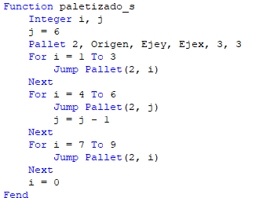

# Laboratorio 2

## Integrantes:

- Oscar Julian Olivos Aguirre
- Daniel Lozano Barrero

## Desarrollo de la práctica

La guía propuesta para el desarrollo de la práctica de laboratorio en las instalaciones de CDM, dispones de instrucciones para la programación de un robot _SCARA T6_ de la marca _Epson_. No obstante, en la visita se dispuso únicamente de un robot de 6 ejes de la serie _VT_.

Por este motivo, tuvo que verse modificado el código de la guía realizado previamente por el equipo, con la finalidad de que el robot dispuesto ejecutase las mismas rutinas que un robot _Scara_.

El algoritmo desarrollado por el robot se descompone en $3$ rutinas principales:
- _Paletizado en z_
- _Paletizado en s_
- _Paletizado externo_

El programa se comunica con el controlador mediante USB, seleccionando la opción en la interfaz de usuario:

### Definición de los puntos

En la pestaña de administrador del robot, se mueve la máquina a una posición de _Home_, se enseña la posición y se le da el nombre de _Origen_.

Así mismo, moviendo el efector final del robot mediante los ejes coordenados globales, se establecen dos posiciones más:

- _Eje x_ : Punto distanciado de _Home_ únicamente por el eje _x_
- _Eje y_ : Punto distanciado de _Home_ únicamente por el eje _y_

>[!Note]
>Las distancias a _Home_ fueron arbitrarias, siempre y cuando el robot no colisionase con algún objeto, y las coordenadas estuviesen dentro del espacio de trabajo del efector final

Procedimiento de enseñanza de coordenadas:
1. Establecer pose de origen del robot
2. Enseñar el punto y llamarlo _Origen_
3. Establecer pose del robot variando únicamente su posición en el eje _x_
4. Enseñar el punto y llamarlo _Eje x_
5. Ir a la pestaña _Ejecutar movimiento_, seleccionar el punto de destino como _Origen_ y ejecutar
6. Establecer pose del robot variando únicamente su posición en el eje _y_
7. Enseñar el punto y llamarlo _Eje y_
8. Ir a la pestaña _Ejecutar movimiento_, seleccionar el punto de destino como _Origen_ y ejecutar

Se poseen los siguientes puntos:

### Código del programa

Ahora bien, se modifica el código _SPEL+_ del programa en el archivo `Main.prg`.

Se declaran variables globales, como la variable `altura`, la cual define el desplazamiento en el eje $z$ en las funciones de paletizado.
La función principal `main` ordena el encendido de motores y el nivel de potencia, así mismo, se establecen los valores de velocidad y aceleración. 

Al inicio el robot se desplaza a su posición _Home_ y entra un bucle de tipo _Do While_. Se hace llamado a las funciones de _paletizado en z_, _paletizado en s_ y _paletizado externo_, en ese mismo orden.

>[!Note]
>`Out_11` y `Out_12` son variables de salidas digitales, en la práctica no se usan

>[!Warning]
>Al ejecutar un programa por primera vez, debe utilizarse el comando `Power Low`, ya que, el movimiento del robot debe ser lo suficiéntemente lento para poder detenerlo en caso de riesgo de colisión. 
>
>Se recomienda que una vez ejecutado por primera vez y usar la opción de potencia alta, la velocidad y la aceleración no excedan valores de $40$

Las funciones de paletizado se caracterizan por brindar el índice del elemento de la cuadrícula.
`Go Pallet(<# instancia paletizado>, <índice del elemento>)`

Para el _paletizado en z_ se instancia el objeto _Pallet_ con una cuadrícula de $3$ x $3$, planteando como base a los 3 puntos anteriormente generados.

Se itera sobre los índices desde el elemento $1$ hasta el $9$.

Cada iteración debe estar inicialmente en un valor mayor de $z$, de tal manera que posteriormente el _TCP_ descienda a un valor menor de $z$ y finalmente vuelva a la coordenada de $z$ inicial.

Se genera la siguiente trayectoria:

>[!Note]
>Debido a que el robot es de tipo 6 ejes, deben ajustarse los valores de $z$ por iteración, este ajuste adicional no habría que hacerlo con un robot _Scara_

La función de _paletizado en s_ posee la misma estructura: instanciación del objeto _Pallet_, iterar el índice, y desplazar el robot al elemento de la cuadrícula correspondiente, variando la altura en el eje $z$ por iteración.

No obstante, aquí se modifica el iterador $i$ con la variable $k$ (iterador modificado). De tal manera que la secuencia es: 1,2,3,6,5,4,7,8,9.

Se genera la siguiente trayectoria:

Otra solución a esta operación es invertir el orden de las posiciones 4, 5 y 6 de la siguiente forma:

Por último, para realizar la rutina de _paletizado externo_, se instancia igualmente como en los anteriores casos pero ahora se añade la palabra clave `Outside`.

El modo en el que se indica el elemento dentro de la cuadrícula es distinto. La cuadrícula tiene coordenadas $(i, j)$, se itera sobre ellas para cubrir todos los elementos. Debido a que el elemento _Pallet_ es una cuadrícula de $3$ x $3$ y se itera hasta $4$ en cada coordenada, el robot hace su paletizado externamente a la cuadrícula planteada.

Se genera la siguiente trayectoria:

## Ejecución del programa

Debe compilarse el código para verificar que este no posea errores sintácticos o de funcionamiento:

Una vez hecho esto, se abre la ventana de ejecución:

Si se corre por primera vez el programa, la casilla de _Baja potencia_ debe estar activada para que se limite la velocidad y se eviten accidentes por colisión del robot con algún objeto dentro de su espacio de trabajo. Después de verificado el código en funcionamiento, se puede desactivar esta casilla. 

Se selecciona la función principal `main` para ejecutar el programa y se selecciona _Iniciar_.

>[!Info]
>El programa completo desarrollado para la práctica se encuentra disponible en: [Código](https://github.com/dlozanob/Robotica/blob/main/Laboratorio%202/Programa.md)

## Implementación
A continuación se puede encontrar el video de la implementación:

[Implementación de el las oficinas de Control de Movimiento](https://youtu.be/E47mI7mMgKQ)

