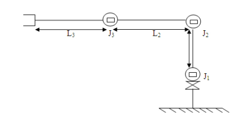
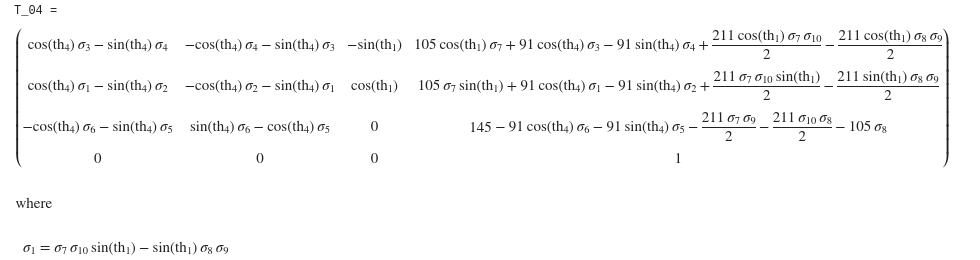
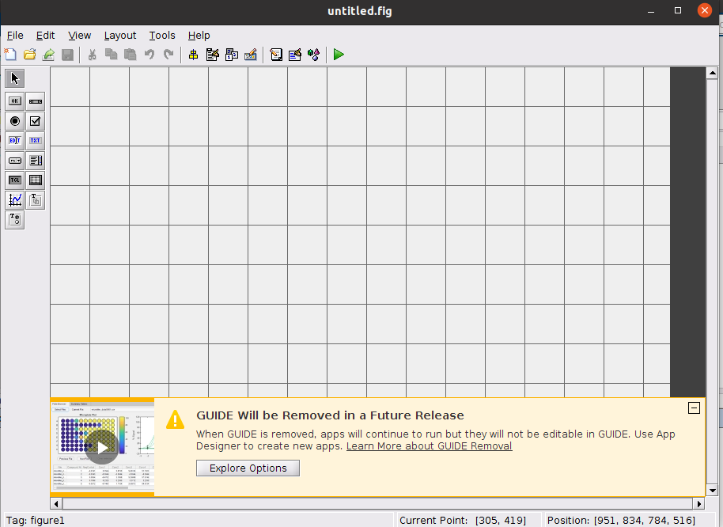
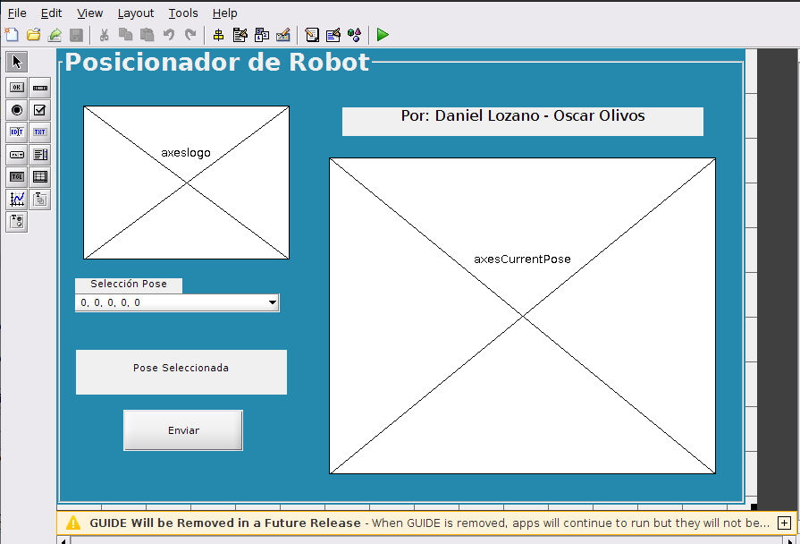
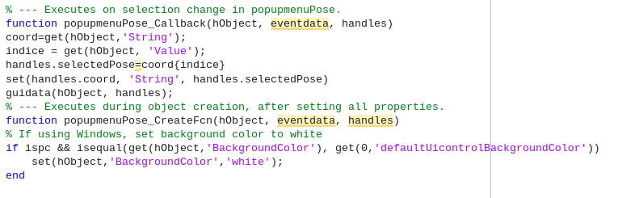
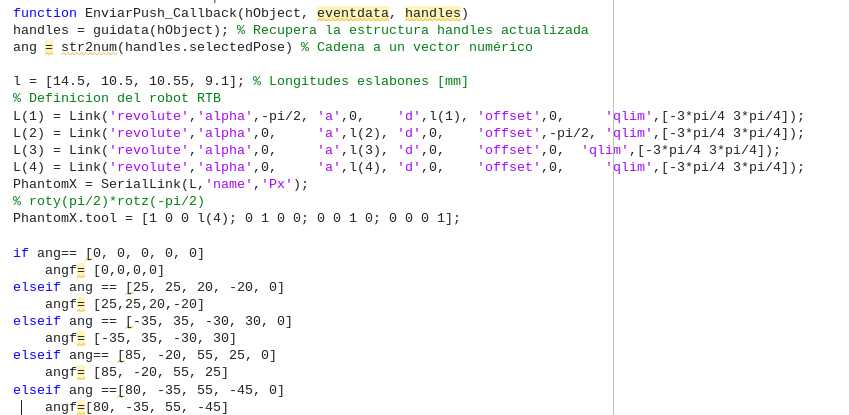
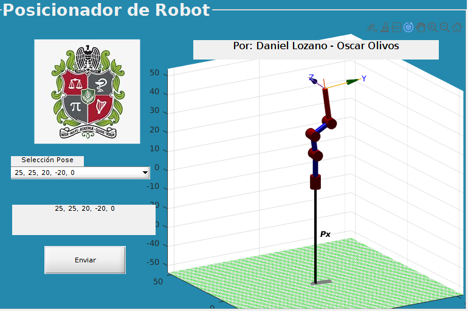

# Laboratorio 4

## Integrantes:

- Oscar Julian Olivos Aguirre
- Daniel Lozano Barrero

## Introducción
Habiendo realizado el acercamiento a las herramientas de ROS en Linux, su integración con Python y la ejecución de instrucciones utilizando Matlab y TurtleSim en la práctica anterior, se dispone aplicar estos conocimientos para permitir manipular y programar cinco posiciones deferentes de un robot Phantom X Pincher, junto con una interfaz de usuario que permita seleccionar la pose deseada y visibilizar la posición actual del robot mediante el uso del Robotic Toolbox de Peter Corke. 

Este laboratorio se desarrolló en una configuración de Linux nativa corriendo mediante Ubuntu y utilizando herramientas adicionales tales como Catkin, el software Dynamixel y Visual Studio Code.

## Mediciones y cinemática directa
### Mediciones
### Cinemática directa

Se desarrolló la cinemática directa del robot, teniendo en cuanta el siguiente diagrama:



En donde luego de medir sus eslabones y realizar el análisis cinemático, se pudo obtener la siguiente matriz de transformación homogénea que describe la posición del efector final respecto a su base:



Posteriormente se encontraron los parámetros que describen la cinemática directa del motor, siendo estos:


Estos parámetros fueron utilizados para configurar los eslabones y la cadena al graficar la simulación del robot en Matlab usando el toolbox de Peter Corke.


## Implementación básica entre dos poses

### Usando tópicos

### Usando servicios

Suscripción del nodo global al tópico `turtle1/pos` publicado por el nodo `turtlesim` y obtener el último mensaje emitido por este tópico.

_Procedimiento:_
1. Suscribir el nodo global al tópico: `posSus = rossubscriber('/turtle1/pose');`
2. Se genera una variable que contiene el último mensaje emitido por este tópico: `LM = posSus.LatestMessage;`

## Configuración en las cinco poses deseadas

En esta sección se describe el procedimiento realizado para poder configurar cinco poses predeterminadas del robot, poder variar entre cada una de ellas mediante un menú de selección, visualizar en simulación la pose deseada y finalmente enviar la pose seleccionada al ejecutable en Python comunicado con ROS.


### Interfaz de usuario en Matlab

La interfaz de usuario fue desarrollada utilizando la herramienta Guide de Matlab, la cual permite configurar una GUI con elementos propios de Matlab tales como botones, menús desplegables, imágenes, gráficas, entre otros elementos.
Para desarrollarla fue necesario primero ejecutar el comando _Guide_ en la ventana de comandos, al hacer esto se abrirá la siguiente ventana:



Se dispusieron los siguientes elementos, cada uno configurado con un nombre o _Tag_, el cual permite referenciar el elemento en el código de Matlab mediante una función o un llamado determinado. Dentro de cada una de estas funciones se ejecutan ciertos comandos o instrucciones que se desean vincular con cada uno de los elementos de la interfaz.



Para cada elemento dispuesto en la interfaz se debe usar el prefijo _handles_, el cual permite identificar que se trata de un elemento de la interfaz. Por ejemplo, para cargar el logo se usó:


Posteriormente la función referente al menú desplegable fue configurada para que cuando se seleccionara una de las poses dispuestas en un vector, se almacenara el índice de la pose deseada en la variable _SelectedPose_. Es importante aclarar que las variables inicialmente son locales, por lo que si se requiere que un valor obtenido dentro de una función de un elemento de la interfaz pueda usarse de manera global, es necesario llamar la función _guidata_.



En el caso de la función del Push Button, se estableció que recuperara la información de _guidata_ para almacenarla su valor. En esta función de igual forma se realizó la definición de la cadena cinemática con el fin de que solo se actualizara la gráfica de la pose de la interfaz hasta que se pulsara el botón _Enviar_. Finalmente dentro de esta función también se guardaba la pose seleccionada en un archivo_.txt_ para su posterior lectura en Python:



A continuación se muestra la interfaz realizada:



### Comunicación Matlab-Python
Debido a que se quería realizar la ejecución de ROS desde Matlab y que por esto el comando _rosinit_ entraba en conflicto con el comando _roslaunch_ al cada uno intentar ejecutar un nodo maestro, se optó por realizar únicamente desde Matlab la configuración de la cadena cinemática, la interfaz de usuario y la selección de pose del usuario, para finalmente exportar los ángulos deseados a un archivo de texto que posteriormente abre y lee Python con el fin de adaptarlos y enviarlos para su posterior ejecución en ROS:

  


### Comunicación Python-Ros


```Python
def getKey():
    fd = sys.stdin.fileno()
    old = termios.tcgetattr(fd)
    new = termios.tcgetattr(fd)
    new[3] = new[3] & ~TERMIOS.ICANON & ~TERMIOS.ECHO
    new[6][TERMIOS.VMIN] = 1
    new[6][TERMIOS.VTIME] = 0
    termios.tcsetattr(fd, TERMIOS.TCSANOW, new)
    c = None
    try:
        c = os.read(fd, 1)
    finally:
        termios.tcsetattr(fd, TERMIOS.TCSAFLUSH, old)
    c = str(c)[2]
    return c
```

La cual utiliza la librería `sys` que viene por defecto en la versión de _Python_ instalada. Esta librería de bajo nivel permite reconocer los eventos de teclado, en la función se traducen estos eventos a un caracter.


Para más información sobre el algoritmo: [Código](https://github.com/dlozanob/Robotica/blob/main/Laboratorio%203/Programas/myTeleopKey.py)
